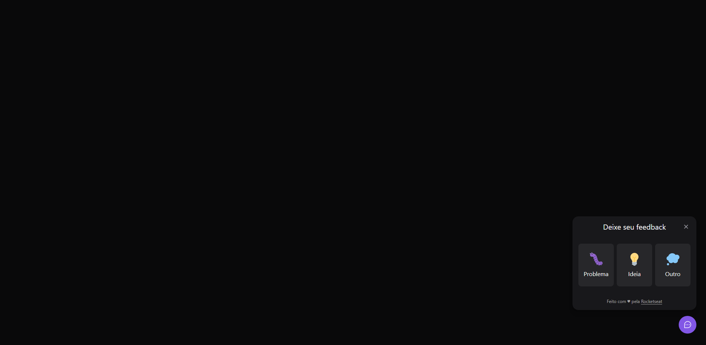
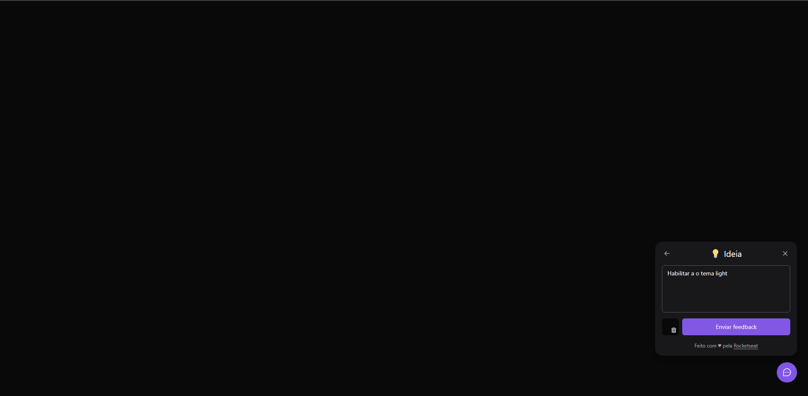
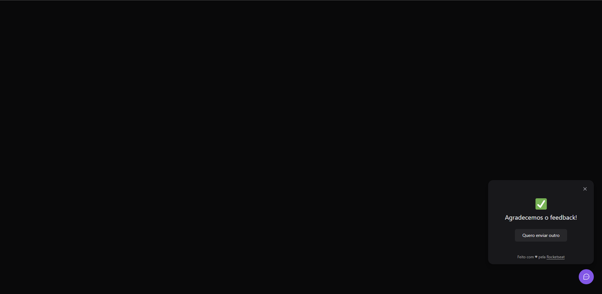
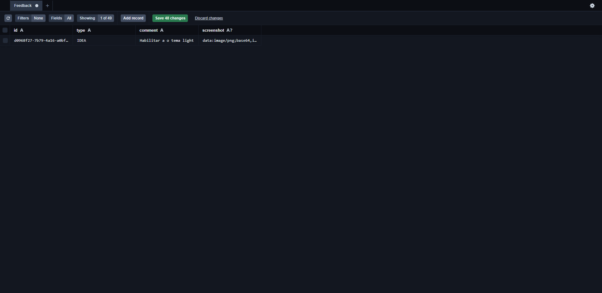

# FEEDWIDGET

# Sobre o projeto

Widget capaz de enviar um feedback da aplicação. O widget envia um texto que deve relatar um problema, uma ideia ou bug. Também pode 
ser enviada uma foto do display no momento do feedback. 

### Explicação do sistema

- Na parte inferior direita da tela fica nosso widget esperando ser clicado para iniciar

- Quando pressionado ele mostra três opções para o feedback "Ideia", "Bug" e "Outros"

- Um ícone de camera pode ser pressionado para que o widget capture o display para ser enviado junto ao feedback

- Com o botão de enviar habilitado é só enviar o feedback e aguardar contato

### Tela inicial


### Opções de Feedback


### Ideia


### Ideia - preenchida


### Sucesso no envio


### Informações no banco de dados


# 🚀 Começando

Essas instruções permitirão que você obtenha uma cópia do projeto em operação na sua máquina local para fins de desenvolvimento e teste.

## 📋 Pré-requisitos

- npm / yarn

## 🔧 Instalação
### :warning::warning: **A pasta imgs**: é para guardar as imagens usadas no readme.md! Apagar ela depois do clone :warning::warning:

``` bash
## clonar repositório
git clone https://github.com/PauloCSantos/NLW-FeedWidget.git

## no diretório server
- criar um arquivo .env
 copie -> DATABASE_URL="file:./dev.db" 
- salvar

## entrar na pasta do projeto no terminal
cd server

## instalar as dependencias
npm i

## executar o projeto
npm run dev

## executar o prisma studio 
npx prisma studio

## no diretório web
- criar um arquivo .env.local
 copie -> VITE_API_URL=http://localhost:3333
- salvar

## entrar na pasta do projeto no terminal
cd web

## instalar as dependencias
npm i

## executar o projeto
npm run dev
```

## 🛠️ Construído com

- Vite
- ReactJs
- TypeScript
- Tailwindcss
- Prisma
- express
- NodeJs

## ✒️ Autor

* **Paulo C Santos** - [Linkedin](https://www.linkedin.com/in/paulocsantos1995/)

## 🖐️ Agradecimento

Agradeço a RocketSeat, o NLW return foi um evento excelente com muito conteúdo prático e teórico.

- Link da RocketSeat: https://www.rocketseat.com.br/
